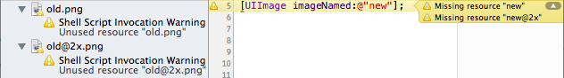

# Respect



## Description

Respect is resource inspector and lint tool to help find issues with
resources in Xcode projects. It is currently focused on iOS projects but
it could with some effort also be used with other kinds of Xcode projects.

It can be used to find issues like:

* Missing files, image and device/scale images
* Unused resources
* Incorrectly named image files
* Incorrect filename casing
* Resources that should not be included in the bundle
* Bundle path collisions

## Install

##### Homebrew

    brew install --HEAD https://raw.github.com/wader/respect/master/misc/respect.rb

If you want to upgrade you should uninstall respect first.

##### Compile from source

    git clone git://github.com/wader/respect.git
    cd respect
    xcodebuild
    cp build/Release/respect /to/somewhere

## Usage

Easiest is to use it as a Xcode build phase run scrip as it then can figure
out project file path, target and build configuration by itself and also
output warnings in a format readable by Xcode to show source annotations
directly in the IDE. You can also use it as separate target or run it from
a terminal.

#### Run script

Add a "Run script" to the target build phases. Example script:

    PATH="$PATH:/usr/local/bin"
    hash respect 2>/dev/null && respect || true

This script makes sure respect is installed before running it and also
makes sure to not cause errors if not, which is probably a good idea
if other people will work on the project that don't have respect installed.

#### Separate target

Add an "External build system" target (under Add Target / OS X / Other):

Set build tool to the path of respect, e.g. `/usr/local/bin/respect`
and arguments to `"$(PROJECT_FILE_PATH)" <TargetName>` where `<TargetName>`
should be replaced by the target name.

#### Terminal

When running from a terminal respect will output warnings and statistics
in a human readable format.

```
$ respect --help
Usage: respect XcodeProjectPath [-cnd] [TargetName] [ConfigurationName]
  XcodeProjectPath                   Path to XcodeProject file or directory
  TargetName (First native target)   Native target name to lint
  ConfigurationName (Release)        Build configuration name

  No arguments are required when running as a Xcode run script.

  -c, --config Path   Configuration file ($SRCROOT/.respect)
  -n, --nodefault     Don't use default configuration
  -d, --dumpconfig    Dump interpreted configuration
  --spfeatures Path   Spotify features path
```

## How it works

Respect reads the Xcode project file and for the selected target and
configuration figures out which resources that will be copied to the
bundle. Then it uses the respect configuration found in the default
configuration, `.respect` and source/header files to find resource
references in the source code. Finally it uses the collected resources
and references to report issues.

#### Configuration

The configuration consist of matchers, actions and ignores. A matcher
looks for resource names in some way and then performs associated
actions when something is "matched".  A action is used to actually
reference resources and can be used with or without a associated matcher.
If a action is associated with a matcher it can use the matched names
when referencing resources, if it's not associated with any matcher the
action will be performed just once.

To associate one or more actions with a matcher you simply list them on the
following lines after the matcher with no empty lines in between. If the
matcher "capture" any strings they can be referred to using `$1`, `$2`, ….
There is also `$0` to refer to the whole matched string.

```
@LintSourceMatch: [UIImage imageNamed:@]
@LintImage: $1
```

This is the configuration to look for resource used by UIKit's
`+[UIImage imageNamed:]`. Here `@LintSourceMatch` is the matcher and
`@LintImage` is the associated action using the captured argument
string `$1` as image name.

#### Where to put configuration

This might mostly be a matter of taste but the different variants have
pros and cons.

Putting all configuration into `.respect` (or some other file using `-c`)
makes it clear where all config is and do not "pollute" the source files.

Using a mix of configuration in both `.respect` and source files have
the advantage that when you in the future remove source files static
actions and ignore configuration in those files are also removed.

In the case of source and resource matchers it does not matter that much
where you put them as you will get warnings if they no longer match anything.

When embedding configuration inside source files you will probably need
to put it inside comments:

```
// @LintSourceMatch: loadImage(@)
// @LintImage: $1
UIImage *loadImage(NSString *name) {
    // load image name
}
```

But in `.respect` there is no need to comment out configuration.

#### Typical workflow

The first time you run respect you will most probably get some false
warnings, most likely about unused resources. Go thru the warnings and
try to find the location in the source code where the problem is.

If for a unused warning you can find a location(s) where the resource
is actually used you could do (in preference order):

* Try to rewrite to code to let the default configuration find the
resource. E.g. don't use formatted strings to load images.

* Add a matcher and actions to let respect find that kinds of
resource references.

* Add action without matcher.

* Add ignore configuration to silence the warning.

As you add matchers and actions the number of unused resources will go
down and respect will use the new configuration to find missing resources.

#### Default configuration

The [default configuration](TODO) included in respect have configuration for
most of the iOS API that deals with resources so you will probably only need
to write matchers for own resource methods.

## Configuration reference

#### Source matcher

    @LintSourceMatch: expression signature | /regex/[ixsmw]

Matches source code using a "expression signature" or a regular expression.
Both expression signature and regular expression can capture strings from the
matched source code that then can be used in actions.

Expression signatures look similar to normal C call `f(…)` and Objective-C
send `[receiver selector]` syntax and can capture both C and Objective-C
string literals using `@` and identifier names using `$`. To ignore an argument
just leave it out `f(, @, )`.  It is also possible to have nested expression
signatures.

Examples:

    @LintSourceMatch: [ImageLoader imageNamed:@ withConfig:@ ignored:]

Matches `[ImageLoader imageNamed:@"image" withConfig:@"config" ignored:@"ignored"]`
with `$1`=`image`, `$2`=`config` and `ignored:` is ignored.

    @LintSourceMatch: loadImage(@, @, )

Matches `loadImage(@"image", @"config", @"ignored")` with `$1`=`image`,
`$2`=`config` and third argument is ignored.

    @LintSourceMatch: [Class arg:function(@,) arg:$ arg:]

Matches `[Class arg:function(@"string", 123) arg:var arg:"ignored"]` with
`$1`=`string` and `$2`=`var`. `123` and `"ignored"` are ignored as the argument
signature is empty.

A special case is that receiver name can include `*` for wildcard match:

    @LintSourceMatch: [[*ViewController alloc] initWithNibName:@ bundle:]

Matches `[[SomeViewController alloc] initWithNibName:@"SomeViewController" bundle:]`
with `$1`=`SomeViewController`.

Regular expression are Cocoa flavoured regular expression. Look at the
[NSRegularExpression](https://developer.apple.com/library/mac/documentation/Foundation/Reference/NSRegularExpression_Class/Reference/Reference.html)
documentation for syntax and options.

#### Resource matcher

    @LintResourceMatch: fnmatch | /regex/[ixsmw]

Match fnmatch pattern (aka glob) or regular expression against all bundle
resource paths.

Examples:

    @LintResourceMatch: *.psd
    @LintWarning: PSD file included in bundle

#### Resource actions

Available resource actions are `@LintFile`, `@LintImage` and `@LintNib`.
They are used to reference resources in the app bundle. They check if
resources exist and marked them as used or warn if they are missing. All
of them also support a name permutation syntax and options to specify
required condition for the permutations.

The permutation syntax is `a{b,c}` to get the permutations `ab` and `ac`.

Condition options are `all`, `any`and `optional`. Where `all` means that all
permutations needs to be fulfilled, `any` at least one and `optional` that
none need to be fulfilled. A action permutation is fulfilled if all required
resources exist. The default condition if not specified is `all`.

Example:

    @LintImage: image{,-selected} all
    @LintImage: image-highlighted optional
    @LintFile: image-{border,shadow}.plist any

This will require that image `image` and `image-selected` exist, image
`image-highlighted` is optional and at least one of the files
`image-border.plist` or `image-shadow.plist` exist.

Note that in the case of `@LintImage` "exist" could mean that required scales
must exist etc.

#### LintFile

    @LintFile: path

Simply reference resources by filename path.

#### LintImage

    @LintImage: name [options]

Is used to reference resources the way `+[UIImage imageNamed:]` do. It support
scale, device and file extension options to configure how to lookup images.

Scale options are: `@1x` (no scale in filename), `@2x` and `568h`.

Device options are: `~ipad`, `~iphone` and `~any` (no device modifier in
filename).

File extension options are: `png` `jpg` `jpeg` `tiff` `tif` `gif` `bmp` `bmpf` `ico` `cur` `xbm`

Image options can be specified using `@LintImageDefault`, with the action or
from the image name. The order in which options are set is default, action and
name e.g:  if `@1x` `@2x` `png` is the default image options, `~iphone` is
specified with the action and the image name is `image~ipad.jpg` the resulting
options will be `@1x` `@2x` `jpg` `~ipad`.

If you don't specify any options for either scale, device or extension they will
fallback to a wildcard behaviour. In that case of scale and device they will
try to find as many existing images as possible. Wildcard extension work a bit
different by using the the extension of the first image found (searched in
the order specified above).

There is one special case if the image name ends with the suffix `-568h` then
the suffix is kept and scale will be set to `@2x`. E.g.: image name `image-568h`
will looks for `image-568h@2x` images.

The table below give some examples for how the options behave:

 Options                     | Behaviour
-----------------------------|----------
*none*                       | Look for all combinations of scale, device and first found extension.<br>`a.png` `a@2x.png` `a@2x~ipad.png` …<br>At least one must be found.
`png`                        | As above but only look for files with PNG extension.
`@1x` `@2x`                  | Require scale 1 and 2 for all combinations of device and first found extension.<br>If `a.png` is found, require `a.png` `a@2x.png`<br>If `a~ipad.png` is found, require `a~ipad.png` `a@2x~ipad.png`
`@1x` `@2x` `~ipad` `png`    | As above but only look for files with ~ipad device modifier and PNG extension.<br>`a~ipad.png` `a@2x~ipad.png`
`~any` `~iphone`             | Only look for filenames with no device modifier or ~ipad device modifier.
`568h`                       | Looks for a `-568h@2x` image.

#### LintNib

    @LintImage: name

Reference a NIB file and images referenced by the NIB. Images will be looked
up using `@LintImageDefault` and modifiers in the image name. The `.nib`
extension is optional and language and device specific nibs will be checked
too.

#### LintWarning

    @LintWarning: message

Can be used to generate warnings when a matcher matches. The default config
uses this action together with resource matchers (`@LintResourceMatch:`) to
warn about wrongly named files and files that probably shouldn't be included
in the bundle.

There is also a `@LintInfoPlist` action to look for resources referenced by
the `Info.plist` file but you will probably not need to use it directly as the
default config already include a `@LintInfoPlist: Info.plist` config line.

#### Ignores

    @LintIgnoreMissing: fnmatch | /regex/[ixsmw]
    @LintIgnoreUnused:  fnmatch | /regex/[ixsmw]
    @LintIgnoreWarning: fnmatch | /regex/[ixsmw]
    @LintIgnoreError:   fnmatch | /regex/[ixsmw]

As respect might not be capable enough to reference some resources you may
need to tell it to ignore some warning and errors. All ignore configurations
take the same argument, a fnmatch pattern (aka glob) or a regular expression.

`@LintIgnoreMissing` and  `@LintIgnoreUnused` matches against the relative
path in the bundle.  
`@LintIgnoreWarning` and `@LintIgnoreError` matches against
the relative path in the source root.

Examples:

```
// @LintIgnoreMissing: images/missing{,@2x}
[UIImage imageNamed:@"images/missing"];
```

Ignore the missing resource reference to `missing` and `missing@2x`. Note that
the file extension is not included as no candidate files were found. If the
path had been `[UIImage imageNamed:@"images/missing.png"]` the missing
resource paths would have been `missing.png` and `missing@2x.png`.

    @LintIgnoreUnused: Some.bundle/*

Ignore unused warnings about all files in the directory `Some.bundle`.

    @LintIgnoreError: Project/generated.m

Ignore errors for the file `Project/generated.m`, e.g. if the file
might be missing.

## Problematic code

Some source code will be hard to find references in as the source matcher do
not use a proper language parser but instead relies on regular expressions
(even when using expression signatures).

Example:

This code is not suitable for matching:

```
NSString *imageName = nil;
if (some condition) {
	imageName = @"enabled";
} else {
	imageName = @"disabled";
}
UIImage *image = [UIImage imageNamed:imageName];
```

But can be rewritten to be:

```
UIImage *image = nil;
if (some condition) {
	image = [UIImage imageNamed:@"enabled"];
} else {
	image = [UIImage imageNamed:@"disabled"];
}
```

Or if you want to keep the code as similar as possible you could do something
like:

```
// @LintSourceMatch: IMAGE(@)
// @LintImage: $1
#define IMAGE(s) s

NSString *imageName = nil;
if (some condition) {
	imageName = IMAGE(@"enabled");
} else {
	imageName = IMAGE(@"disabled");
}
UIImage *image = [UIImage imageNamed:imageName];
```

## Tricks and gotchas

#### Why do I get warnings about files containing "$1" etc?

This is probably because a action is faulty not associated with any matcher,
e.g. a misspelled matcher config like `@LinSourceMatch` instead of
`@LintSourceMathch`.

#### How do I ignore an argument when using a source matcher?

Just leave out `@` or `$` for the argument:

    @LintSourceMatch: [receiver ignoredArgument: matchedArgument:@]

And

    @LintSourceMatch: loadImage(, @)

Will ignore the first argument and match a second string argument as `$1`.

#### Why do I get warnings about missing @2x images?

The default config is that `@LintImage` require that both @1x and @2x exist
if one of them exist. You can change this using:

    @LintImageDefault: @1x

Now the @2x image is not required.

#### Can I lint all nib files in the bundle without matching references in source code?

Yes you can use a resource matches like this:

    @LintResourceMatch: *.nib
    @LintNib: $0

But note that this will mark all nib files in bundle as used so you won't get
warnings about unused nib files.

#### I want to use whitespace with @LintFile, @LintImage etc.

Both matcher and action configuration support quotes so you can do:

    @LintFile: "Path with whitespace/$1"

Escaping is also supported if you need to have literal quotes.

## Help developing

See the [CONTRIBUTING.md](CONTRIBUTING.md) file.

Thanks to [Travis CI](http://travis-ci.org) and
[Coveralls](https://coveralls.io) there are automatic builds, unit tests and
code coverage reports. Current status for master branch:

[](https://travis-ci.org/wader/respect)
[](https://coveralls.io/r/wader/respect)


## Notes and known issues

`@LintImage` does not behave exactly as `+[UIImage imageNamed:]`, e.g.
`[UIImage imageNamed:@"image~ipad.png"]` will on iOS fallback to
`image.png` if `image~ipad.png` is missing. Currently this will be reported
as `image~ipad.png` is missing and `image.png` will not be marked as used
if it exist.

Preprocessor directives like `#if` etc are not supported.

Matching of concatenated literal strings are not supported.

Handling of `#import` and `#include` is limited. It currently only supports
local includes relative to the source file or directories configured with the
header search path build configuration. Also header files are a bit tricky as
they don't have a "target membership" in the project file so they will only
be linted if they are included directly or indirectly by some target source
file.

Resources bundles are not handled and I'm not really sure how it could be
done correctly.

When running from terminal some build configuration paths are guessed and some
are missing.

You can specify multiple file extension options but in most cases it makes no
sense.

With `any` condition if one permutation is fulfilled one or more other
permutations might be "half" fulfilled and mark files as used.

Permutation syntax support nested `{}`.

Capture strings are always unescaped.
